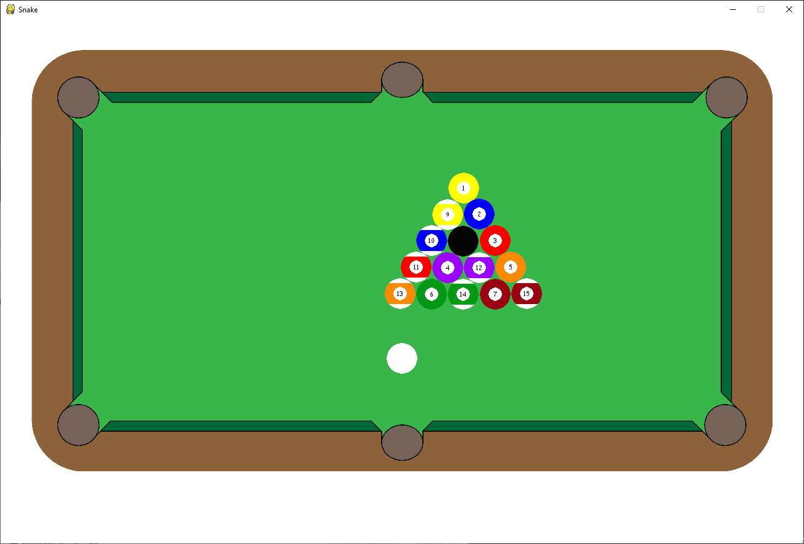

# pygame-pool
I made this simple 8 ball pool game in python to learn some basic game physics. 
I implemented some math to calculate collisions between two balls (https://vobarian.com/collisions/2dcollisions2.pdf).
I also implemented my own algorithm to calculate collisions between multiple lines and a ball.

## Pool table
I designed this pool table in Adobe Illustrator according to some real dimensions. I created a physics model for this table with raw coordinates to calculate collisions.

## physics
The game ball can be hit with the pole. All balls are subject to friction of the table. They also loose energy on every impact with a wall or another ball.

## Gameplay
For now, when a ball hits a hole it just disappears. Since this wasn't intended to be a full on game but rather a fun project to play with I didn't implement any more game logic.

